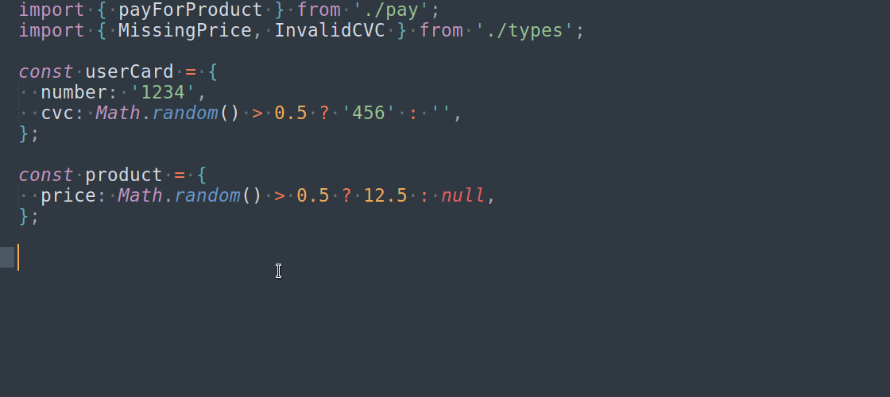

# Type-safe errors in TypeScript

## Overview
`type-safe-errors` provides type-safe domain errors to Typescript.  
It comes with an async promise-like interface but with strong-typed handleable errors.

## Table Of Contents

* [Installation](#installation)
* [Philosphy](#philosphy)
* [Examples](./examples)
* [API Reference](./docs/REFERENCE.md)
* [Inspiration](#inspiration)

## Installation

```sh
npm i type-safe-errors
```

### Basic example

```ts
import { Ok, Err } from 'type-safe-errors';

class InvalidCredentialsError {
  __brand: 'InvalidCredentials'
}

function authorizeUser(username: string, password: string) {
  if (username === 'admin' && password == 'admin') {
    return Ok.of({
      name: 'admin',
      isAdmin: true,
    });
  } else {
    return Err.of(new InvalidCredentialsError());
  }
}

authorizeUser('admin', 'admin')
  .map((user) => {
    console.log('authorized! hello ', user.name);
  })
  .mapErr(InvalidCredentialsError, (err) => {
    // err is fully typed err object (InvalidCredentialsError class instance)
    console.log('Invalid credentials!', err);
  });
```

## Description
If you work with rich business logic it's common to use exceptions in js to represent different states of the application. The problem with this solution and TypeScript is that when you catching an exception, you lost information about it's types. 

Let consider this simplified example from an [express](https://expressjs.com/) controller:

```ts
try {
  await payForProduct(userCard, product);
} catch (err) {
  res.send(500, "Internal server error");
}
```

By looking at this code, you can not determine what kind of exception can happen.
Of course, you can check `payForProduct` body, but what if it's called other functions? And they call more? For rich business logic, it's unmaintainable to follow all
possible custom exception just by reading the code.  

Because of this, it's common to just return `500` in such cases (`express` doing it by default). But there can be many errors that should be handled differently than `500` status code. For example, maybe the user does not set any address data yet? Maybe his cart expired? Or did he provide an invalid CVC number?  

The client app should be informed of the reason, for example, by `400` status code and error details in the response body. But first, to properly handle the errors, the developer must be aware of what errors can happen.  
This is the problem that `type-safe-errors` library is trying to solve.  



(Full example: [./examples/basic-example](./examples/basic-example))

## Philosphy

### Minimal API
Learning and using `type-safe-errors` should be simple and straightforward. To achieve this, the API must be as simple and as intuitive as possible. It's one of the reasons why the result class is always async (e.g. [neverthrow](https://github.com/supermacro/neverthrow) have two different result types, one for sync and one for async results handling).
The long-term goal is not to handle every possible use case. Instead, it's to do one thing well - providing a way to handle domain exceptions in a strong-typed, future-proof way.

### Practical API
Using `type-safe-erros` should be similar in feel to work with traditional js [promises](https://developer.mozilla.org/en-US/docs/Web/JavaScript/Reference/Global_Objects/Promise). You can [map](./docs/REFERENCE.md#okmapcallback) any success result (same like you can [then](https://developer.mozilla.org/en-US/docs/Web/JavaScript/Reference/Global_Objects/Promise/then) fulfilled promise) or [mapAnyErr](./docs/REFERENCE.md#errmapanyerrcallback) (same as you can [catch](https://developer.mozilla.org/en-US/docs/Web/JavaScript/Reference/Global_Objects/Promise/catch) rejected promise).

You could notice that the `type-safe-error` project is somehow based on [Either](https://github.com/sanctuary-js/sanctuary-either) concept from functional programming. But the goal was not to follow the idea closely but to provide an easy-to-use API in practical js work, focused on async programming.

## Inspiration
 - [Expressive error handling in TypeScript and benefits for domain-driven design](https://medium.com/inato/expressive-error-handling-in-typescript-and-benefits-for-domain-driven-design-70726e061c86)
 - [STOP throwing Exceptions! Start being Explicit](https://www.youtube.com/watch?v=4UEanbBaJy4&t=5s)
 - [200 OK! Error Handling in GraphQL](https://www.youtube.com/watch?v=A5-H6MtTvqk)
 - [neverthrow](https://github.com/supermacro/neverthrow)
 - [Khalil Stemmler: Flexible Error Handling w/ the Result Class](https://khalilstemmler.com/articles/enterprise-typescript-nodejs/handling-errors-result-class/)
 - [Functional Error Handling with Express.js and DDD](https://khalilstemmler.com/articles/enterprise-typescript-nodejs/functional-error-handling/)
 - [Either](https://github.com/sanctuary-js/sanctuary-either)
